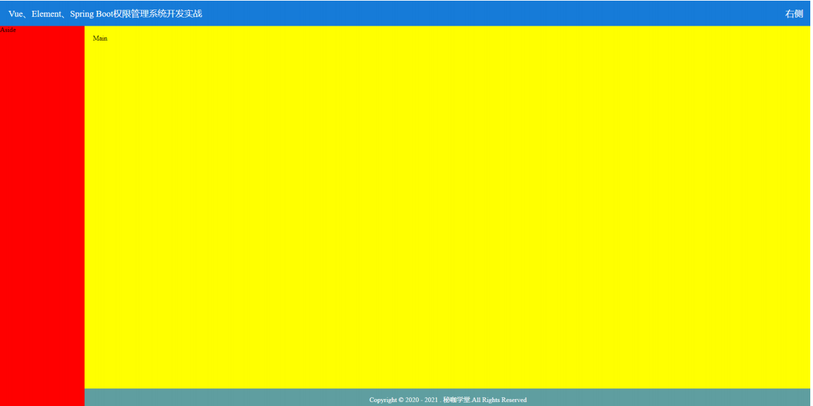
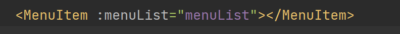
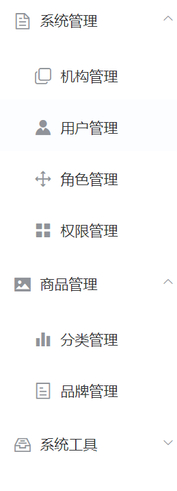
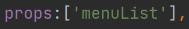
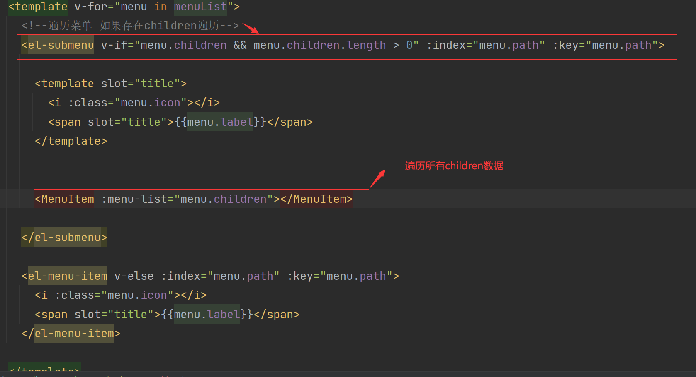
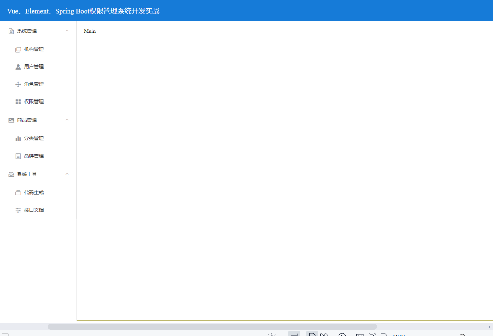
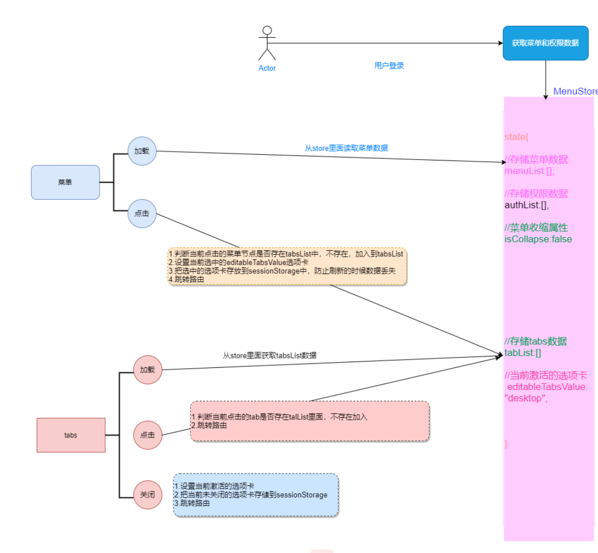

#### 1.技术点
|  技术点   | 网址  |
|  ----  | ----  |
| element ui | https://element.eleme.cn/#/zh-CN |
| 单元格  | 单元格 |
###### 1.技术要点

html、css3、js、vue基础
###### 2.适合人群
有html、css3、js、vue基础，想学习vue-element-ui开发后台管理系统的在校大学生、工作人员；

想学习如何实现动态菜单、动态路由、按钮权限的在职人员；

####第1讲 登录页面表单验证

###### 1.1、表单非空验证

​	在不输入用户号码、密码、验证码的情况下，不能提交表单
###### 1.2、验证规则

1. 给 <el-form> 表单添加 ref，model ，rules  这几个属性一定要添加，否则校验不生效，以及值对应；
ref  表单被引用时的名称，标识 this.$refs.shop.validate() 与这个对应
model 表单绑定对应的数据域
rules 表单的验证规则

2. 给  <el-form-item> 添加 prop属性，属性值需要与form数据域的属性一致;

####第2讲 主界面布局讲解

1、布局规划
本讲主要实现如下所示的界面布局，布局分为上、中、下结构；
上部为头部，分为左、右两边，其中左边为系统的logo和标题；右边为个人头像和退出登录的按钮
等；
中部为内容主体： 左边为菜单栏，右侧为内容展示区
底部通常为版权信息栏

#### 第3讲 主页头部右侧头像、时间布局
1、布局规划
本讲主页讲解头部右侧用户头像，时间，退出等布局，最终效果如下所示
鼠标移动到头像时，展开下拉菜单，可以到个人中心、退出登录等

#### 第4讲 左侧菜单布局(重点)

1.左侧菜单布局遍历实现讲解

将菜单分别放到不同组件中用于遍历。将菜单数据放入子组件中

---------------------------------------------------------
接收父件组件数据

遍历所有的菜单数据

2.效果展示

#### 第5讲 标签页设置流程图

